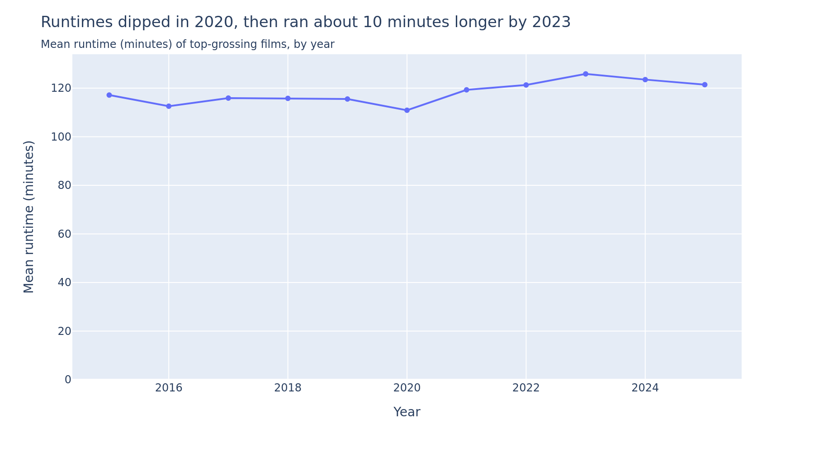
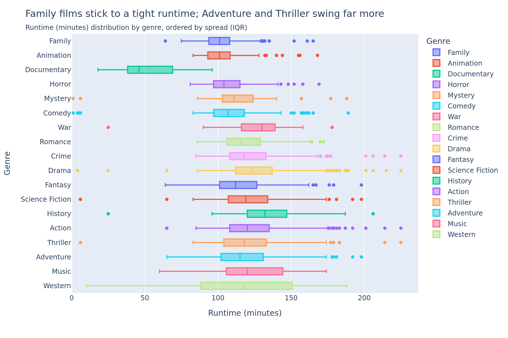
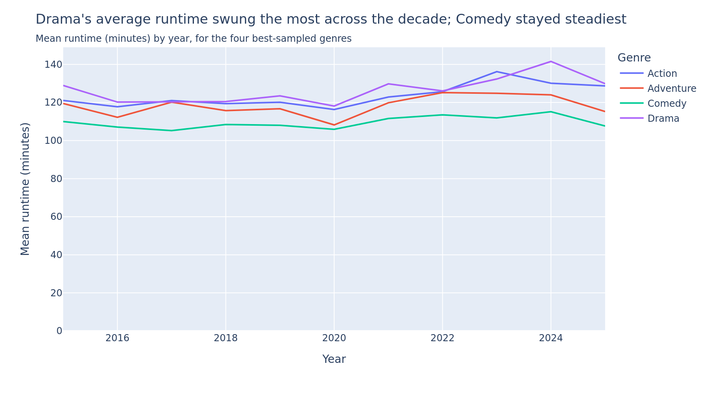

# Are Top-Grossing Movies Getting Longer?

*Runtime trends in the highest-grossing films, 2015–2025*

## What we set out to find

Movies feel like they've been getting longer — big franchise films in particular seem to keep stretching past the two-and-a-half-hour mark. But is that actually true across the board, or does it just feel that way because a few very long films stand out?

This report asks two simple questions about the highest-grossing films of the last decade: **has their average runtime changed over time, and does that pattern differ by genre** — are action films getting longer while comedies stay the same, for instance?

## Where the numbers come from

The analysis is built on roughly **1,100 of the highest-grossing films released between 2015 and 2025** — about the top 100 earners at the box office each year — pulled from [The Movie Database (TMDB)](https://www.themoviedb.org/), a large, community-maintained film database.

For each film, we know its runtime, release year, revenue, and genre(s) — many films carry more than one genre tag (a movie can be both "Action" and "Comedy," for example). A handful of entries in the raw data had clearly broken runtimes — one "film" was listed at a single minute long — so those were cleaned out before calculating any averages. The technical detail behind that cleanup, along with the full methodology, is in the [Appendix](#appendix) below.

## Finding 1 — Runtime over time

Average runtime dipped in 2020 — down to 110.9 minutes, in the pandemic year when film releases were widely disrupted — then climbed fairly steadily afterward, peaking at 125.8 minutes in 2023 before easing slightly to around 121–123 minutes in 2024 and 2025.

Put another way: films in 2023 ran about 15 minutes longer, on average, than films in the 2020 dip. But zoom out to the full decade and the picture is milder — 2015 started at 117.1 minutes, not far from where 2024–2025 landed. **2020 looks like a one-off dip tied to that year's disrupted theatrical releases, not the start of a runaway trend toward longer movies.**

## Finding 2 — Runtime by genre

Not every genre behaves the same way. **Family** and **Animation** films are the most consistent — they cluster tightly around a predictable runtime, rarely straying far from it. **Adventure** and **Thriller** films, by contrast, swing much more widely — some are short, some stretch well past two hours, with no single "typical" length.

(Two genres — Western and Documentary — look even more extreme in the chart above, but that's a data artifact rather than a real pattern: there are only 7 Western and 5 Documentary films in the entire dataset, far too few to draw a reliable conclusion from. More on this in the [Appendix](#appendix).)

## Finding 3 — Which genres change most over time

Restricting to the four genres with enough films every year to compare fairly — Action, Adventure, Comedy, and Drama — **Drama's average runtime moved around the most across the decade**, while **Comedy stayed the steadiest**, barely drifting from year to year. Action and Adventure sat in between, each moving more than Comedy but less than Drama.

## What it all means

Two things stand out. First, **genre matters more than year**: knowing a film's genre tells you far more about how long it's likely to run — and how much that could vary — than knowing what year it came out. A tightly-paced Family film and a sprawling Adventure epic released in the same year can differ by well over half an hour; that gap dwarfs anything the decade-over-decade trend produced.

Second, the industry-wide shift in runtime over 2015–2025 is real but modest — a matter of minutes, not a dramatic lengthening of movies as a whole. The 2020 dip and the following rebound look more like a pandemic-era disruption than the start of a longer-term drift toward longer films.

One caveat worth keeping in mind: this dataset only covers the *highest-grossing* films each year — blockbusters, essentially — not the full range of films released. These findings describe how long the biggest hits run, not movies in general.

---

## Appendix

### Data source

All data comes from TMDB's public API:

- `GET /discover/movie` — used to find the top ~100 films by revenue for each year, 2015–2025 (5 pages of 20 results per year, sorted by `revenue.desc`).
- `GET /movie/{movie_id}` — used to fetch full details (runtime, genres, budget, revenue, release date) for every film found above.

This produced 1,100 films in total (100 per year × 11 years). The full collection code is in `notebooks/NB01-Data-Collection.ipynb`.

### Data structure

The cleaned data is stored as three related tables (`notebooks/NB02-Data-Transformation.ipynb` builds these, into both CSVs and a SQLite database):

- **`movies`** — one row per film, with runtime, revenue, budget, release year, etc.
- **`genres`** — one row per unique genre.
- **`movie_genres`** — a join table linking films to genres, since a film can belong to several genres and a genre spans many films (a many-to-many relationship that a single flat table can't represent without duplicating rows).

### Runtime cleaning

TMDB uses `runtime = 0` as a placeholder when it has no runtime data for a film, rather than the film genuinely being zero minutes long — those rows are dropped entirely during transformation (NB02). Separately, seven films in the remaining data have implausibly short but *nonzero* runtimes (1–25 minutes) — almost certainly bad or corrupt entries rather than real theatrical releases. These are excluded from every average and trend line in this report (so they don't drag down the numbers), but they're kept visible in the full-distribution chart (Finding 2's box plot), where they still show up as outlier points.

### How genres were ordered and why small genres are flagged unreliable

Finding 2's chart orders genres by their **interquartile range (IQR)** — the gap between the 25th and 75th percentile of runtimes — from most consistent to most variable. This measures the spread of the *typical* film in that genre, ignoring extreme outliers.

Two genres have very few films in this dataset: **Western (7 films)** and **Documentary (5 films)**. With samples that small, a single unusual film can swing the whole picture — Documentary's five runtimes, for instance, are 18, 45, 46, 60, and 96 minutes; three cluster tightly together while two (18 and 96) sit far apart, which is why the chart shows a narrow box but very long whiskers for that genre. Neither genre's spread should be read as a reliable pattern.

### Other limitations

- **Multi-genre films.** A film with several genres is counted once per genre, so genre-level runtimes aren't fully independent of each other — expected and appropriate for genre comparisons, but the reason Finding 1 (which isn't split by genre) uses a deduplicated film table instead.
- **Sparse genres in Finding 3.** Yearly averages need enough films per year per genre to be stable, which is why Finding 3 is restricted to the four best-covered genres (Action, Adventure, Comedy, Drama) rather than all eighteen.
- **Top-revenue sampling.** The dataset is only the highest-grossing films each year, so every finding here describes blockbusters specifically — not the full population of films released in a given year.

### Reproduce this analysis

The full code — data collection, cleaning, and analysis — is available at [github.com/domenicapalominoh-lang/me204-final-project](https://github.com/domenicapalominoh-lang/me204-final-project), along with setup instructions in the repository's README.
